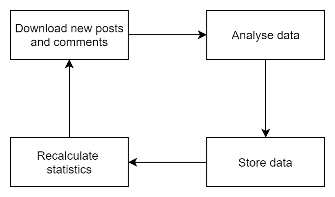

```
This chapter is intended to describe the following

- High-level description
- basic user interaction
- Data flow
- How we will develop

User is expected to have no prior knowledge about Socneto

GuidesLines
- Neodkazujte se na Wikipedii (ani v diplomkách apod.). Buď dejte odkaz na něco sofistikovaného (specifikaci, knihu, o;dborný článek, web produktu apod.) nebo nic. 
- Odkazy by bylo dobré dělat standardním způsobem ([2, 16, 4] a číslovaný seznam na konci)
```

## High level description

Socneto is an extensible framework allowing user to analyse content across multiple social networks. Analysis and social network data collector can be provided by user. 

Social networks offers free access to data, although the amount is limited by number of records per minute and age of the post which restrict us from downloading and analyzing large amount of historical data. 

To overcome those limitation, Socneto focuses on continuous analysis e.g. it watches for any new posts or comments to the followed topic. It downloads the data, analyses them, stores the results and updates respective statistics. 



The project support only basic form of data analysis such as topic extraction and a complex one - sentiment analysis supporting english and czech languages. In terms of data acquisition, there are two supported social networks Twitter and Reddit. Both of them supports open API with limited access to the data. If user requires additional analysis to be made or any other data to be downloaded, it can be done by extending the framework by own implementation. 

This project does not serve to any specific user group, it tackles the problem of creating concise overview and designing a multi-purpose platform. It aims to give the user an ability to get a glimpse of prevailing public opinion concerning a given topic in a user-friendly form.

## Use case 

Generally, a user specifies a topic for analysis and selects data sources and type of analyses to be used. The system then starts collecting and analyzing data. User can then see summary in form of sentiment chart, significant keywords or post examples with the option to explore and search through them. 

A typical use cases is studying sentiment about a public topic (traffic, medicine etc.) after an important press conference, tracking the opinion evolution about a new product on the market, or comparing stock market values and the general public sentiment peaks of a company of interest.

The framework runs on premises thus a user is responsible for handling security and connecting to storage compliant with GDPR rules. 

## An architectural overview

The framework consists of multiple modules forming a pipeline with modules dedicated to data acquisition, analysis, persistance and also to module managing the pipeline's behavior. The components will be described in details in a chapter [Platform](##Platform)

The components communicate via message broker making the communication asynchronous which increases throughput. For more details, please refer to [Communication chapter](##Communication).


