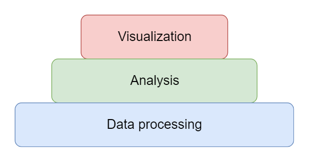
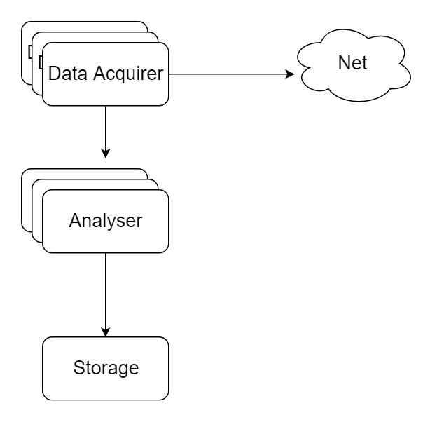
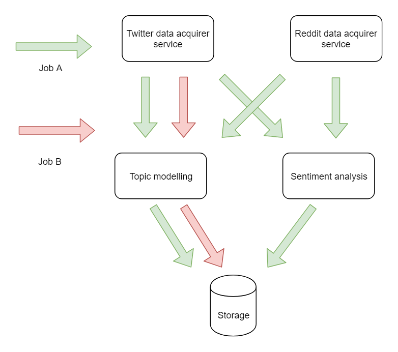
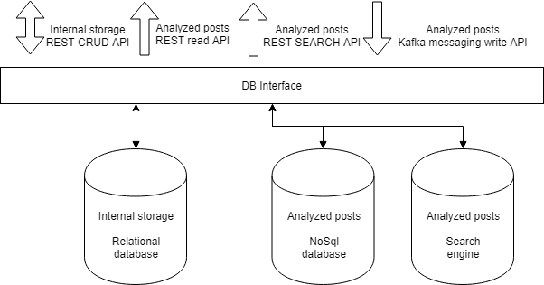
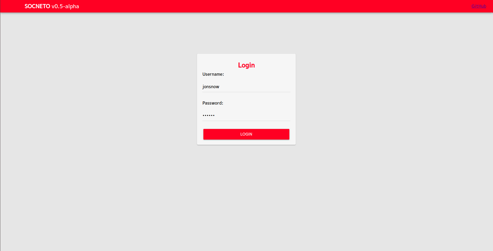
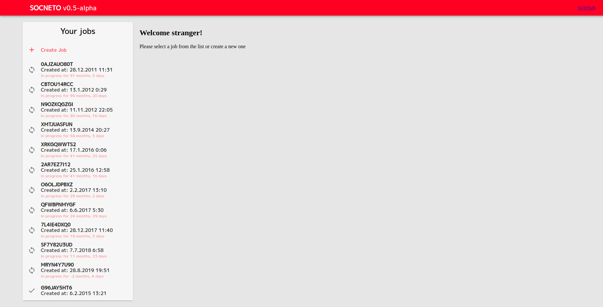
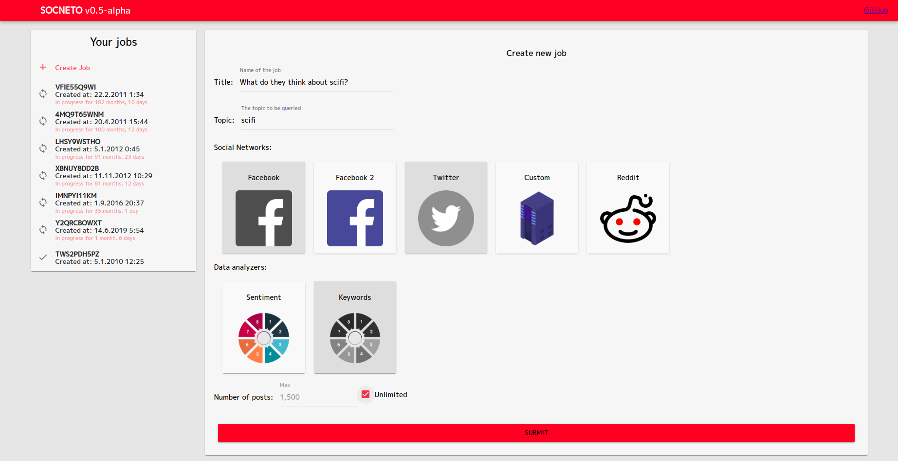

# SOCNETO specification

For more than a decade already, there has been an enormous growth of social networks and their audiences. As people post about their life and experiences, comment on other people’s posts and discuss all sorts of topics, they generate a tremendous amount of data that are stored in these networks. It is virtually impossible for a user to get a concise overview about any given topic.

This project offers a framework allowing the users to analyze data related to a chosen topic from given social networks.

## High level description

Socneto is an extensible framework allowing user to analyse content across multiple social networks. It aims to give the user an ability to get an concise overview of a public opinion concerning a given topic in a user-friendly form based on a data collected across social networks.

Social networks offer free access to data, although the amount is limited by number of records per minute and age of the post which restrict us from downloading and analyzing large amount of historical data. 

To adapt to those limitations, Socneto offers continuous analysis instead of one times jobs. It continuously downloads data and updated reports 


The project supports only limited types of data analyses such as topic extraction and sentiment analysis supporting english and czech languages. Additional types of analysis can be supplied by user himself. 

In terms of data acquisition, Socneto supports two main social networks Twitter [1] and Reddit[2]. Both of them support limited free API used by default or an unlimited API for users who have paid accounts. Additional social network adapters can be also supplied by user.

## Use case 

Generally, a user specifies a topic of interest, selects type(s) of analysis required and social networks to be used as data source. The system then starts collecting respective data, run them through analysers and store results. User can then see results either in tabular version or visualized with customizabled charts.

A typical use cases is studying sentiment about a public topic (traffic, medicine etc.) after an important press conference, tracking the opinion evolution about a new product on the market, or comparing stock market values and the general public sentiment peaks of a company of interest.

The framework runs on premises thus a user is responsible for handling security and connecting to storage compliant with GDPR rules, thus security of the system and a Security of the data are both responsibilities of a user. 

## An architectural overview

This project is designed to be a platform processing data from various sources focusing on data from social networks. Data themselves have little value for end user if they are not analysed and visualized properly. To reflect those priorities, layers of the project architecture can be visualized as follows  



_This picture shows conceptual separation of application responsibilities. The most important part is to develop the data processing platform, then to properly analyse the data and present them to the user. (we are aware that the customer might think otherwise)_

The backbone part of this project is a data processing platform responsible for data acquisition, data storage and cooperation among all components to successfully deliver any results to the user. 

In order to interpret acquired data correctly an analysis is performed. There are many possible approaches how to analyse data from the internet, thus analyses has to be extensible by the user to fit his needs. 

Analysed data are then presented to the user in a concise form supported by visualizations and sample data.

Requirements stated above are solved by various cooperating modules. Those modules are connected together forming a pipeline with modules dedicated to data acquisition, analysis, persistance and also to module managing the pipeline's behavior. 


_Diagram shows simplified version of the pipeline processing data_

## Planning

The following section offers and insight into the team composition, responsibilities of members and project milestones.

### Team

|Name|Responsibilities|
|:--|:--|
|Irena Holubová| Supervisor|
|Jan Pavlovský|Machine learning engineer, software engineer – builds the platform with a focus on machine learning integration|
|Petra Doubravová|Machine learning, linguistic specialist – develops the sentiment analysis model |
|Jaroslav Knotek|Software engineer – designs and builds the platform|
|Lukáš Kolek|Data engineer – designs and develops the data storage|
|Július Flimmel|Web engineer – builds the web application and frontend|

### Development process

The development follows agile practices. In the beginning, the team will meet every week to cooperate on an analysis and an application design. 

Once the analysis turns into specification and is defended, the team divides into two group cooperating on separate parts focusing on a data platform and machine learning reflected in analysers. 

Best results are achieved when the team works together. The cooperation will be encouraged by several all-day-long workshops when the whole team meets at one place personally in order to progress.

The process of development is divided into three  approximately equally long phases. The first one focuses on creating proof-of-concept(PoC) making sure that project's assumptions are not false. In the second phase, the team focuses on setting up proper storage, implementing advanced features such as sentiment analysis or proper result visualization and last but not least implementing mocked parts properly. The last part consists of creating deployment guide, writing documentation and testing. 

The plan described is vizualised on the following picture which shows three phases with key milestones. Greyed out parts represent already finished milestones. The following sections will describe each phase in detail.


#### 1. Proof-of-concept

The application relies heavily upon asynchronous communication between all components. To prove that the idea is plausible, communication should be tested by mocked components configured to communicate with given components using Kafka and random data.

This PoC runs on infrastructure which consist of several virtual machines provided by the university. 

This phase should have proved that the idea is plausible. At the beginning, the test featured only test data acquisition component and a test analyser but as the development advances, they will get replaced with production version and the other types components will get connected as well. 

The product of this phase is working simplified platform supporting basic data flow and a final specification reflecting gained experience. The platform is capable of coordinating all components which is necessary to support basic user interaction e.g. submitting job and querying results.

This PoC was responsibility of Jaroslav Knotek and Lukáš Kolek. At the same time, samples of front-end and analysers were developed by Július Flimmel and Petra Doubravová respectively.

This phase is already finished. The next step is to implement proper data flow and implement all mocked components.

#### 2. Data flow

As the platform stabilizes, more focus is put to proper data acquisition, storage and querying. When user submits job, all components have to cooperate in order to deliver expected results.

At this point, storage is build to store all data e.g. data from social network and application data needed for a proper job execution. It will be followed by proper implementation of data acquisition component downloading data and feeding them to an analyser. This will be also responsibility of Jaroslav Knotek and Lukáš Kolek.

The sentiment analyser is expected to be the most complex and the most risky part of the whole project. It will require great deal of effort to develop, test and finally integrate it into the framework. This will be supervised by Petra Doubravová and Jan Pavlovský.

At this point, first result will start to emerge. We will start collecting data and start creating overview based on real data. The result visualization will be developed by Július Flimmel.

#### 3. Finishing and polishing

The last phase focuses on extendibility and deployment as well as improving precision of supported analysers. The application will be extended by the other data acquisition component connecting to Reddit, and a analyser covering simple topic extraction. 

Once all the component are ready, project will start to finalize with testing sessions that will focus on technical aspect of the framework but also on a user interaction. At this point we will have found a partner that will supply us with his data in exchange for our services. At this time we are communicating with few community service associations such as Hlídači státu or Milion chvilek pro demokracii whom we want to offer our services. 

## Supported analyses

Two types of linguistic tasks will be implemented:
* Topic modeling
* Setiment analysis.

Intention of the projec is not to implement completely new solution, but use existing third-party packages and customize them. Some training data will be needed for this purpouse, which is a little bit problematic in the case of czech language. We do not assume anotation of new data. For this reason and also for a difficulty of topic modeling, we do not expect human-like results. As it was said before, platform will be easily exensible by another implementation of analysis.

Both tasks involve 

- preparation(gathering and cleaning) of training and testing data 
- integration and customization of existing packages
- adapting to two languages czech and english and different data e.g. possible long texts from reddit and very short and concise twitter posts.

### Topic modeling (TM)

This is generally a difficult problem for both languages, because it is not clear, what is the wanted result and also some language-specific rules are too complex to be solved automaticaly yet. In addition, twitter data are typicaly really short, no full sentences, mixture of languages, emtoticons and broking gramatical rules, so classical approach to this task will not work very well.

Possible approaches :
* Word frequency + dictionary - quite easy approach, but it can't handle i.e. pronoun references
* Entity linking - knowledge base needed
* Entity modeling  - knowledge base needed
* Some probabilistic models (Latent Dirichlet Allocation - LDA)

Combination of different approaches will be used:
frequency, LDA and maybe entity linking, as for czech existing knowledge base is not so large. We will use existing libraries and knowledge bases.

Topics for hierarchiacal structures like posts + their comments must be find for post and related comments together. Result of this kind of analysis is set of key words related to the post/post+comments structure.

### Sentiment analysis (SA)

Quite subjective task. Output of this analysis is at the first place polarity - negative, positive, neutral. Model is based on BERT [8], and last layer must be implemented according to the task and trained. Progress at this field is consulted with members of UVFAL.

## Platform architecture

Platform is separated to three different tiers 

- Data processing tier
- Analysers
- Front-end(visualisation)

Each tier consists of several services responsible for a sub domain. Service oriented architecture improves separation of concern and also allows us to implement each service in different language that fits the problem the most. For example, data processing services are implemented in well-established enterprise-level languages such as java or c#. On the other hand, analysers are better off being implemented using less strict language such as python offering number of libraries related to our cause.

The Data processing tier consists of services acquiring and storing data, cooperation of all components, system health and data processing pipeline management.  Analyser tier consist of various services responsible for analysing data of a given format and are expected to produce data of a given format. Front end serves user to understand the results on the first glimpse.

The backbone of the whole pipeline is to acquire data that user request by submitting a job definition containing query, selected analysers and selected social networks. The platform translates it to tailored configuration made uniquely for each component. 

Design of the whole framework requires a lot of effort in order to avoid common pitfalls of school project. Main possible weak spots would be communication among multiple services, customizations and extensibility and last but not least testing.

### Acquiring data

The api limits restrict amount of data being downloaded in a given time interval. For exampletwitter standard api limits[5] allows connected application to lookup-by-query 450 posts or access 900 post by id in 15 minutes long interval. Reddit has less strict limits allowing 600 request per 10 minute interval. Those limit must be reflected in each data acquirer. 


Both apis restrict free users from downloading large amount of data and also it does not allow access to data older than 7 days. Even though that the limits are very restricting, continuous analysis saves the day, it downloads small portion of the up-to-date data, analyses and immediately updates the results

A request for data acquisition contains information about requested data in a form of a query and optionally credentials if user does not want to use default one. Then the data acquirer starts downloading data until user explicitly stop it. 

Output of each data acquirer follows the system-wide format of unified post data(UPD) that features 

- text
- creation or modificaiton time
- link to related post (in case of a comment or retweet)
- user id

Socneto will support acquiring data from Twitter and Reddit with use of 3rd party libraries `LinqToTwitter`[6] and `Reddit.Net`[7] respecively. Both of them will make it easier to comply with api limits and tackle respective communication(limits must be reflected in each component itself). Each library has its own dedicated service and both of the will be written in c#.

### Analysers

Each type of analysis reside in its own service. The input format is the same as output of data acquisition services. The analyzers will process data received from the acquirers. After analyzing each post they send the result to the storage. Because results of the analysers are the used by frontend, the analyzers' output will need to be in some standardized form. As this output will be mainly processed by a computer, we decided to use a computer friendly JSON format.

The structure of the JSON will need to be robust and simple enough, so that the user of frontend may easily specify which data he wants to visualize using JSONPath. The structure of the output is following:

```json
{
    "analyzer_name": {
        "analysis_1": { "type": "number", "value": 0.56 },
        "analysis_2": { "type": "string", "value": "rainbow" },
        "analysis_3": { "type": "[string]", "value": ["friends", "games", "movies" ] }
    }
}
```

The whole analysis is packed in one object named after the analyzer. As the analyzer may compute multiple analyses at once, each one will be also represented by one object named after the analysis. The object representing the analysis has a strict format. It contains exactly two attributes:
 * *type*: specifying the type of the result. The supported types will be *number* (including integers and floating point values), *string* and *lists* of these two. Lists of lists will *not* be supported,
 * *value*: the actual result of the analysis

There may be multiple analyzers in our framework, so all their outputs are inserted into one analysis object. We don't use arrays of objects but named objects instead, so that the user may easily specify analyzer and analysis in JSONPath when creating a new chart on frontend.

Here we provide an example of a post's complete analysis. It contains analyses from two analyzers - *keywords* and *topic*. Keywords analyzer returns one analysis called *top-10* where the values are found keywords in the post. The topic analyzer returns one analysis, *accuracy*, specifying how much the post corresponds to the given topic.
```json
{
    "keywords": {
        "top-10": {
            "type": "[string]",
            "value": [
                "Friends", "Games", "Movies", ...
            ]
        }
    },
    "topic": {
        "accuracy": {
            "type": "number",
            "value": 0.86
        }
    },
}
```

Implementation of the types of analyses requires different amount of effort but integrating them will cost the same. Both of those services will be written in python and will require additional effort to integrate it into the system.

### Communication

Each service runs in a separate docker container. Packing services into docker container makes deployment easier since all required dependencies are present inside the container. Containers(except front-end and respective back-end) communicate using a message broker Kafka [3] which allows for high throughput and multi-producer multi-consumer communication. 

In our case, data can be acquired from multiple data sources at the same time and send to multiple analysis modules. Data processing is difficult to cover by request/response model. More elegant and simplier solution is to use publish/subscriber model which Kafka supports.

The services responsible for acquiring the data(producers in kafka terminology) produce data to a given channel that are delivered to all services that listening on this channel(comsumers). It also keeps track of which message was delivered and which was not delivered yet, so if any component temporarily disconnects, it can continue at work once the connection is up again. 

Another benefit of message broker is that particular services does not aware of a sender of its input data and of receiver of its output. It makes it easy to configure data flow.

### Cooperation

Main pitfall of asynchronous communication a lack of feedback from receiver. More specifically sender is not sure whether anyone is actually listening. In order to tackle this problem, Job Management Service(JMS) was introduced. 

Job management is responsible for proper cooperation of all components. JMS is the component that each component need to register to before the system start working. When user submits a job, JMS transforms it to multiple tailor-made requests for all involved components. Each request contains configuration that influences which data belonging to a given job will be redirected to each output. 

For example, if user submits a job _A_ that requires sentiment analysis of data from Twitter and Reddit with respective paid account credentials, the required types of analyses are topic modeling and sentiment analysis. JMS delivers job configuration with twitter credentials only to twitter data acquiring service, reddit credentials to reddit data aqcuiring service and directs output of data related to the given job to the both of the analyser servcies. Situation might get complicated when another job _B_ is submited requiring only data from twitter and a topic modelling. JMS will configure selected components to handle data of the given job differently without affecting the already running job.

The data routing of the parallel jobs A and B is visualised on the following picture.



_The picture shows two jobs running in parallel._

To make sure that components are up an running, some system monitoring was implemented.

### Data

Data store is designed for running on a different machine without a public network connection for better security, different technical requirements for machines and possible scalability. Behind a storage interface are several databases for different purposes and the interface is created for a transparent communication with all databases. More databeses were chosen for better sacability and partitioning.

#### Store components

- Database interfase
  - This component makes abstraction over an implemented polyglot for the rest of platform. Consists of "public" API for communication
  with the web app BE and Kafka client for receiving analyzed posts from analyzers and internal clients for databases.

- Relation database
  - Usage: internal data such as users, jobs, logs, configurations etc.
  - Requirements: Storage for relational data with possible JSON fields
  - Used implementation: [PostgreSQL](https://www.postgresql.org)

- NoSQL database
  - Usage: internal data such as users, jobs, logs, configurations etc.
  - Requirements: NoSql storage
  - Used implementation: [MongoDB](https://www.mongodb.com)

- Search engine
  - Usage: searching in anayzed posts
  - Requirements: full text search
  - Used implementation: [Elasticsearch](https://www.elastic.co/products/elasticsearch)

_Any database nor search engine is not hard-coded and should be possible to replace it with a different component. Only a client interface
needs to be implemented._

_It is more common to not use Elasticsearch as a primary database. In latest versions Elastic improved and removed some berriers for this approach. But we decided to implement our storage "traditional" way and duplicate data in Elasticsearch._

#### API

- REST CRUD API for internal storage
- REST Read API for analyzed posts
- REST Search API for analyzed posts
- Write Kafka message listeners

#### Entities

Main expected entities with mandatory fields:

- User: userId, password
- Job: id, userId, job config, timestamp
- Log: componentId, timestamp, status, message, additional data
- Post: id, jobId, ordinal post with additional info, list of analysis



_Storage architecture_

### System monitoring

The application architecture is loosely coupled, which brings a lot of possible orchestration problems. Platform should contain a component, which is responsible for collecting logs from analyzers, acquirers and possibly data storage. As the platform is already using Elasticsearch, a [ELK stack](https://www.elastic.co/products/elastic-stack)  is efficient for this propose. [Logstash](https://www.elastic.co/products/logstash) is responsible for collecting logs from the application, for communication is also reused already mentioned Kafka, Elasticsearch is need for storing logs and [Kibana](https://www.elastic.co/products/kibana) for visualization. Logs will be also persisted inside relational database.

_It is expected that only some technical user - admin will have permission for Kibana dashboard with logs. On the other hand basic statuses of running jobs will be also displayed for a user in our UI._

### API 

The backend API works using HTTP protocol and REST architecture. It works as a (protection / access) layer between frontend and storage modules of SOCNETO framework. It provides access to the authorized users to their jobs, their results and visualisation definitions.

#### Authentication and authorization

To provide protection of the data, almost each API call requires the user to be authenticated and authorized for their usage. These calls expect *Authorization* HTTP header to be filled. As perfect data protection is out of scope of this work, we use only *Basic authorization* for simplicity. After authenticating the user the backend also verifies, whether the user is authorized to read the data he is requesting. If not, a message with HTTP status code *401 (Unauthorized)* is returned. If the user is authoried, the requested data is returned.

For frontend to be able to implement login, the backend contains login call. This call expects username and password in body and returns the user object which corresponds to the given credentials. If there is no such user status code *400 (Bad Request)* is returned.

#### Jobs

The API provides calls to request list of user's jobs, their details and their results. Only authorized users are able to see these data. The user is able to access only those jobs (including their details and results) he submitted. 

The API also contains endpoint for submiting a new job. This endpoint expects correct job definition otherwise returns HTTP status code *400 (Bad Request)*. The correct definition contains title, topic, non-empty list of data acquirer components to be used, non-empty list of data analyzer components to be used and number of posts to fetch (if not unlimited). *JobId* is returned if the job was successfuly created.

#### Visualisation definitions

The user needs to be able to store and load the definitions of his visualisations (see Frontend - Job Detail section). The backend provides API to list already defined visualisations of user's job and to define a new one.

### Front end 

The primary purpose of our frontend is to provide a user a tool to configure and look at multiple different visualisations of the analyzed data. The application will also allow the user to specify and submit new jobs to the platform and will inform him about their progress. The last functionality allows administrators to manage and configure individual components of the whole platform.

#### DartAngular + Material
We chose to make the frontent as a *web application* to develop a cross-platform software which is user friendly and easily available. We chose to use a modern and widely used style guidelines / library *Material Design* to quickly build nice and proffesional looking product. We stick with *DartAngular* because its library provides us with [angular components](https://dart-lang.github.io/angular_components/) which already use Material Design.

#### Components
Angular uses a component-based architecture, so each page is composed of multiple components. In this section we provide a description of the views the user can encounter and the components they are made from.

#### Login
As mentioned in the API section, the backend requires the user to be authorized for most requests. Therefore the user needs to login before he starts using the application. After signing in with correct combination of username and password, the user is redirected to his dashboard. The credentials are also stored in localstorage, so the user does not need to insert them on each page reload. 

If a user tries to access content to which he is not authorized (receives HTTP result with status code *401*), he is immediatelly redirected to special page, where he is informed about it. From there, he can try visit different content or sign in again.


#### Dashboard
The Dashboard displays history of all jobs the user ever submitted including a simple information about them (name, submission date). After selecting a specific job, a component with more details about the job and data visualisations are shown. The list of jobs also contains a button which shows component for submitting a new job.


#### New job
This component aims to easy, user-friendly ability to submit a new job. We use Material input components to provide the user with the best UX. The user can specify *name* of the job, *topic* to be searched for, which registered SOCNETO *components* to use (analyzers and data acquirers) and number of posts to fetch, or unlimited.


#### Job detail
The job detail component contains list of user specified visualisations of the analyzed data. It also contains a paginated list of all acquired posts and their analyses.

At first, the component contains no visualisations. The user has to specify which data from the analyses he wants to be visualized. This approach gives the user a great degree of freedom instead of being presented by hardwired charts. When creating a new chart, the user only has to select the type of chart (pie chart, line chart, ... TODO: which types we want to support?), and write a JSONPath to the attrribute to be visualised (see Analyser output part). These definitions of charts are then stored in our storage, so the user does not need to create them each time.

<!--- TODO: screen maybe (list of visualisations, new visualisation, list of posts) --->

#### Admin
TODO: write more here (how to access it, how does it work?)
Only users with admin privileges are able to access this component. It serves to make the user able to add, remove or configure data analyzer and data acquirer components.
### System health

A system that consist of multiple components is hard to maintain. In order to simplify investigation of failing services and to speed up recovery process, the framework will store and manage all metrics using ELK stack[4]. Proper metric tracking requires definition of system wide guidelines of what values will be tracked and what alarms should be fired when componets are malfunctionning. Integration of this system requires its installation on our infrastructure and integration in each service.

### Extensibility

Socneto framework allows user to extend data acquisition, analysis and visualisation as well. Data acquisition and analysis services must follow an API and must run in a docker file. 

- component registration flow in order to connect the component to the system
- input/output API

This application can run in a docker as the rest of the system or it just has to be able to connect to the message broker Kafka. 

### Deployment 

The easiest way to deploy Socneto is to use deployment script in order to download all required docker containers and start them at once. This way depends on a valid system configuration and existing storage and metrics systems. 

### CI/CD and automation

CI/CD is implemented using [TeamCity](https://www.jetbrains.com/teamcity/). It allows for a deployment pipeline definition in which code in the repository get automatically tested, then containerized and deployed. This pipeline is triggered by push to a given branch of the repository.

## References
```
[1]: https://twitter.com
[2]: https://reddit.com
[3]: https://kafka.apache.org/
[4]: https://www.elastic.co/what-is/elk-stack
[5]: https://developer.twitter.com/en/docs/basics/rate-limits
[6]: https://github.com/JoeMayo/LinqToTwitter
[7]: https://github.com/sirkris/Reddit.NET
[8]: BERT: https://arxiv.org/abs/1810.04805
```
